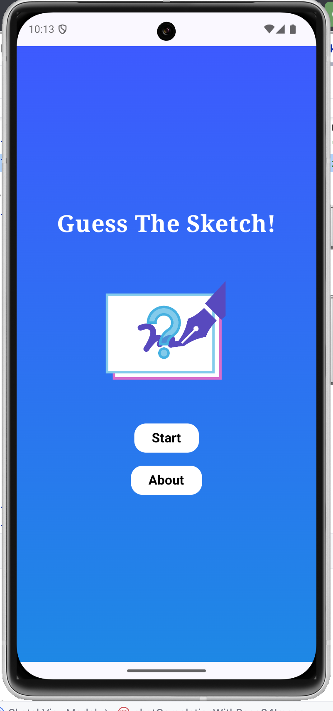
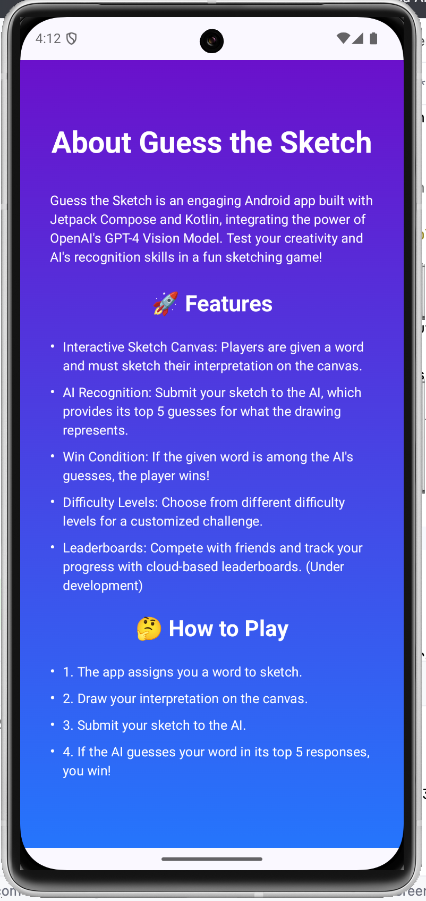
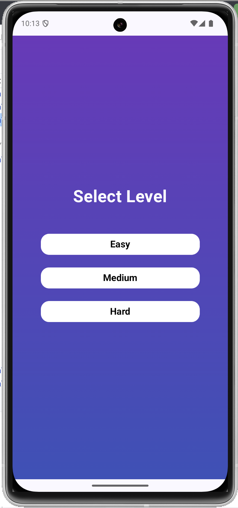
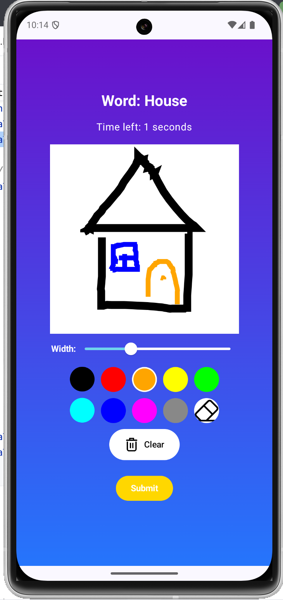
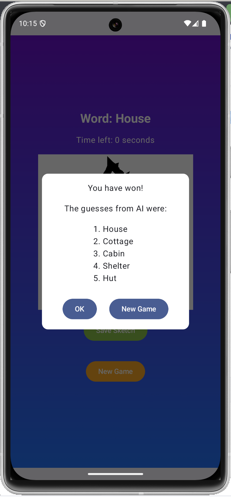
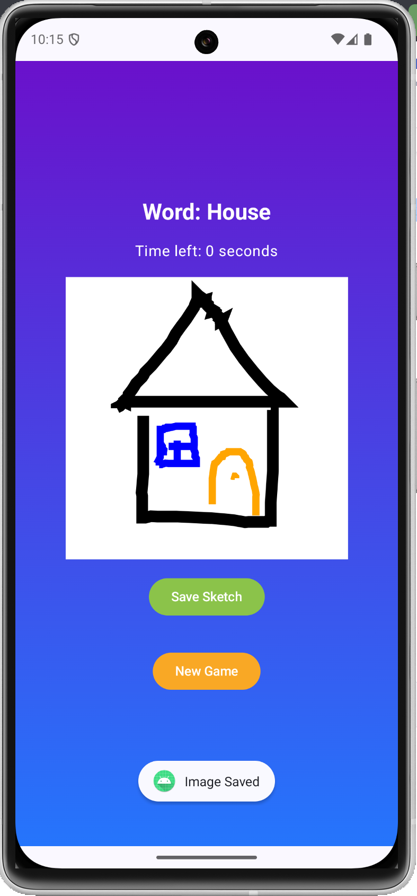

# Guess the Sketch 🎨🤖

**Guess the Sketch** is an engaging Android app built with **Jetpack Compose** and **Kotlin**, integrating the power of OpenAI's **GPT-4 Vision Model**. Test your creativity and AI's recognition skills in a fun sketching game!

## 🌐 Try the Game

👉 **[Visit and Play](https://appetize.io/embed/b_ll3l6aehmudirl7dv7kyda2jii)** the game yourself!

## 🚀 Features
- **Interactive Sketch Canvas:** Players are given a word and must sketch their interpretation on the canvas.
- **AI Recognition:** Submit your sketch to the AI, which provides its top 5 guesses for what the drawing represents.
- **Win Condition:** If the given word is among the AI's guesses, the player wins!
- **Difficulty Levels:** Choose from different difficulty levels for a customized challenge.
- **Save Sketches:** Save your sketches locally for future reference. *(Under development)*
- **Leaderboards:** Compete with friends and track your progress with cloud-based leaderboards. *(Under development)*

## 🖼️ Demo
Here are some screenshots showcasing the app in action:

### Main Menu

### About Page

### Level Selection

### Sketching Canvas

### AI Guess Results

### Sketch Saved Confirmation

## 🛠️ Architecture
The app leverages **ViewModel architecture** to ensure robust state management and seamless UI interactions.

## 🌩️ Cloud Features (Coming Soon)
- **Sketch Storage:** Save your sketches in the cloud for cross-device access.
- **Leaderboards:** Showcase your achievements and compete globally.

## 📲 Technology Stack
- **Jetpack Compose** for a modern, declarative UI.
- **Kotlin** for clean and concise code.
- **GPT-4 Vision Model** for advanced AI-based sketch recognition.

## 🤔 How to Play
1. The app assigns you a word to sketch.
2. Draw your interpretation on the canvas.
3. Submit your sketch to the AI.
4. If the AI guesses your word in its top 5 responses, you win!

## 📥 Download and Try It!
Download the APK in this repository and experience the fun of **Guess the Sketch** for yourself!
